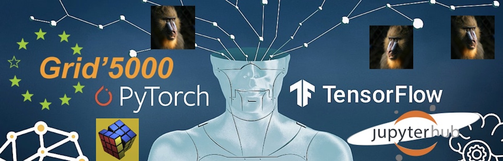
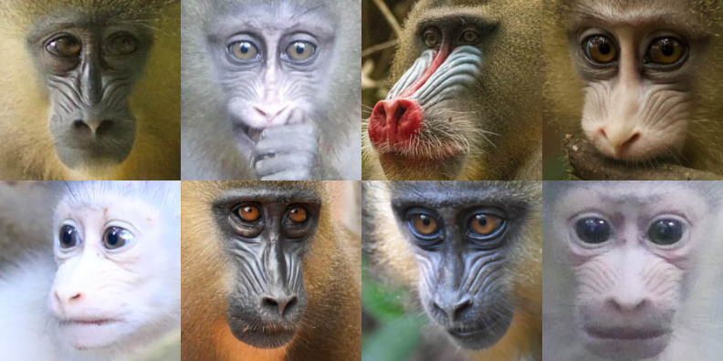

# Deep Learning sur G5K: feedback

### Présenté par le SISR - LORIA | SED - INRIA
#### Cyril Regan & Romain Karpinski

---

# Objectifs

- Apprendre à
    - Utiliser jupyterhub (CPU/GPU)
    - Lancer des jobs en passif avec oar
    - Montrer des bonnes pratiques de développement et une architecture logicielle
- **L'objectif n'est pas d'apprendre à faire de l'IA**

---
# Contenu du tutoriel

- Notebook en cpu/gpu
- Transition du notebook vers mode passif/batch avec
    - [**lightning-hydra**](https://github.com/ashleve/lightning-hydra-template) template de projet IA
    - [**singularity**](https://github.com/sylabs/singularity) container
    - **oar** batch scheduler
- Executer plusieurs expériences en mode batch
- Visualiser les résultats avec [mlflow]( https://mlflow.org/#features ) 
- Bonus : lancer des expériences en parallèle avec **GNU parallel**
---

# Choix d'un projet réaliste

**La Mandrillus Face Database:**
- Projet de recherche en écologie et biologie évolutionnaire.
- Etudier une population de mandrills au Gabon en milieu naturel.
- Labels : identité / sex / age ...
- Objectif: obtenir (regression) un âge à partir d'une photo

---

# Retour d'expérience

- Négatif:
    - **Jupyterhub n'a pas tenu la charge (tester à 3 != tester à 20)**
    - Manque de pré-requis de certains participants:
        - Commandes système de base
        - Connexion ssh
    - Peu de retours via questionnaire numérique envoyé après coup

---
# Retour d'expérience

- Positif:
    - Forte participation (20 incriptions en 3 jours) -> besoin existant
    - Des profils différents (étudiants/professeurs/ingénieurs)
    - Faire connaître le service/expertise IA dans le laboratoire
    - Collaboration avec un autre service (SED INRIA)

---
# Perspectives

- Se concentrer sur une technologie
- Approfondir une tâche d'IA spécifique
    - Scientific machine learning (PINNs)
    - Image generation
    - ...
---

# Thank You !